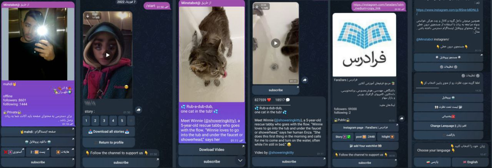
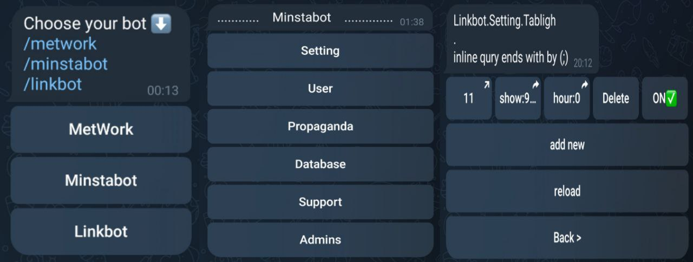

# minsta bot

## Attention
I made this project for fun
This project is written specifically for CPanel and works with webhook, so it needs changes to run these codes in another environment.

## Important note
When I didn't start this bot until I turned it off forever, the users increased by about 300,000. It needs a lot of care. When it is used a lot, you should increase the Instagram accounts connected to the bot. I have more than 100 connected accounts. I did it and all of them were blocked. In the end, the IP was also blocked, so be careful if you use it

## How to enable webhook example

This project works with two robots

 - The first bot is the Instagram downloader bot, which works independently and is in the <> file, but you will not have any control over it.
  
`https://api.telegram.org/bot<TOKEN>/setWebhook?url=https://<your-domin-name>/MetWork/<TOKEN>`

- The second bot is a manager bot that can manage many bots, here it only manages the Instagram downloader bot.
With this robot, you can add admin, manage ads and...

`https://api.telegram.org/bot<TOKEN>/setWebhook?url=https://<your-domin-name>/Minsta-Bot/<TOKEN>`

#### A view of the admin robot

 